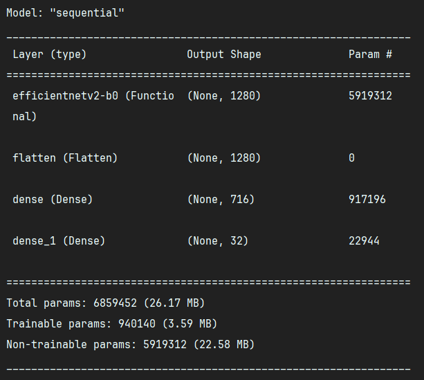
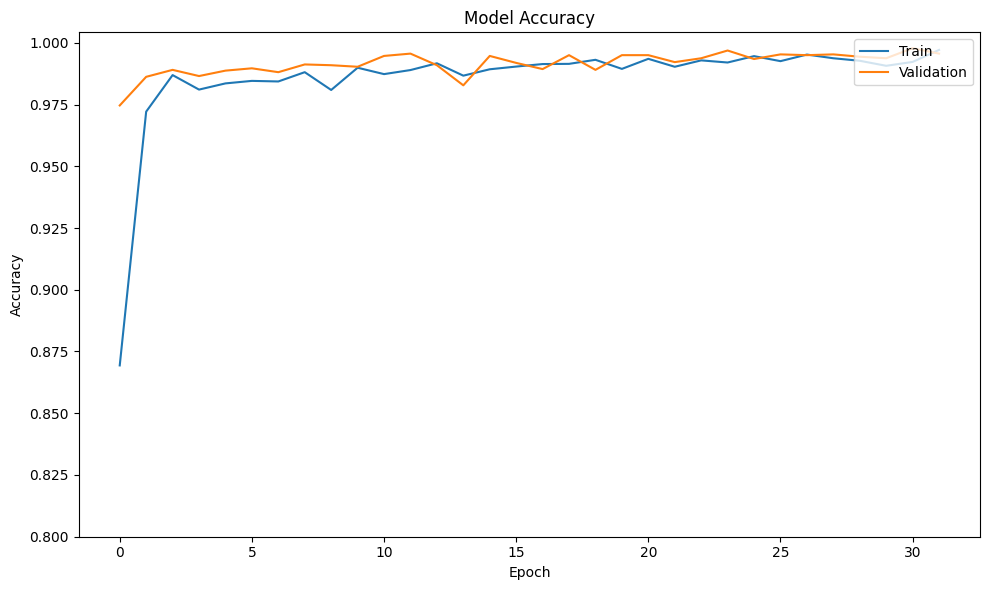

<a name="readme-top"></a>

<br />
<div align="center">
  <a href="https://github.com/caraka-id/machine-learning">
    
    
  </a>

<h3 align="center">Machine Learning Workspace</h3>

  <p align="center">
    Building Model for Detecting Indonesian Scripts
  </p>
</div>

<br />
<p align="justify">


  In the machine learning workflow, I began by curating and creating my own datasets,
  ensuring that they were representative of the problem at hand. Utilizing TensorFlow,
  I employed the <code>image_dataset_from_directory</code> function, configuring the image to a size of
  150 x 150 x 3. For training and validation, the data was divided 80:20 split.
  Employing the  <code>tf.data.AUTOTUNE</code>  feature, I fine-tuned the data processing pipeline
  for optimal efficiency. Leveraging transfer learning, I implemented the <code>EfficientNetV2B0</code>
  architecture, initializing the model with weights pre-trained on the 'imagenet' dataset.
  Subsequently, I trained the model on the prepared data, achieving a high level of accuracy.
  To preserver the trained model, I saved it in the <code>.h5</code> model format and securely stored
  it in the Google Cloud Platform, ensuring accessibility and scalability for future 
  applications and analysis. This comprehensive workflow reflects a systematic
  approach to developing and deploying machine learning models.

  To improve feature extraction, the picture is first read using the 
  opencv-python package. It is then converted to a grayscale representation
  and blurred. The image is then examined to determine an appropriate threshold 
  that helps separate items from the background. The borders of the
  segmented items are then shown by contours. Drawing bounding boxes around the
  recognized items in the picture is the last step. Specifically, these bounding
  boxes are sorted according to their coordinates using the code snippet
</p>

```python
boxes.sort(key=lambda x: (x[0], x[1]))
```

<p align="justify">
  The sort function's lambda function arranges the segmented objects in a systematic
  manner for additional processing or analysis by primary sorting the boxes
  according to their horizontal (x-axis) and vertical (y-axis) locations.
  Maintaining order and making it easier to complete activities that depend on the
  spatial relationships between the items in the image are made possible by this
  sorting process
</p>

<div align="center">
    
    
    
</div>

<p align="justify">
  The primary focus of this project centers on the development of a machine 
  learning model designed for character detection, leveraging the renowned 
  <code>EfficientNetV2B0</code>, convolutional neural network architecture. 
  Notably, pre-trained weights sourced from ImageNet form a foundational 
  component of the model's training. The retraining process involves 
  selectively updating the last few layers of the network while preserving 
  the weights of the earlier layers.
  To train the model, a Kaggle and hand-drawn dataset are collected 
  by the team is used, resulting in a total of more than <code>10.000</code> 
  images. The dataset is split using a <code>80:20</code> ratio for training
  and validation sets purposely.
</p>

<div align="center">
    
    

</div>

<p align="justify">
  The model passes through more or less than 35 epochs during the training phase, with
  a learning rate of 0.0005. The employment of <code>categorical-crossentropy</code>
  as the chosen loss function and the application of the <code>AdamW</code> optimizer
  help this procedure. This well-designed configuration improves the model's
  ability to learn and identify characters correctly

  Once the classification model has been successfully trained, 
  the project moves on with the seamless integration of other 
  characteristics, including picture segmentation. The model's 
  capabilities are increased by this tactical enhancement, 
  making it a fully functional scanner. This combined capability 
  makes the model more effective and creates new application 
  opportunities by enabling it to carry out more complicated 
  tasks than only character identification.

  This project, taken as a whole, demonstrates how to deploy EfficientNetV2-B0
  effectively, use a variety of machine learning techniques, including transfer
  learning with pre-trained weights, and build a strong character identification
  model. The use of picture segmentation not only improves the model's overall
  performance but also expands its capabilities, making it a multipurpose scanner.
</p>


### Built With

[![Python][python]][python-url]
[![Tensorflow][tensorflow]][tensorflow-url]
[![Keras][keras]][keras-url] 
[![OpenCV][opencv]][opencv-url]
[![Numpy][numpy]][numpy-url]
[![Matplotlib][matplotlib]][matplotlib-url]

[tensorflow]: https://img.shields.io/badge/TensorFlow-%23FF6F00.svg?style=for-the-badge&logo=TensorFlow&logoColor=white
[tensorflow-url]: https://tensorflow.org/
[python]: https://img.shields.io/badge/python-3670A0?style=for-the-badge&logo=python&logoColor=ffdd54
[python-url]: https://python.org/
[keras]: https://img.shields.io/badge/Keras-%23D00000.svg?style=for-the-badge&logo=Keras&logoColor=white
[keras-url]: https://keras.io/
[opencv]: https://img.shields.io/badge/opencv-%23white.svg?style=for-the-badge&logo=opencv&logoColor=white
[opencv-url]: https://opencv.org/
[numpy]: https://img.shields.io/badge/numpy-%23013243.svg?style=for-the-badge&logo=numpy&logoColor=white
[numpy-url]: https://numpy.org/
[matplotlib]: https://img.shields.io/badge/Matplotlib-%23dddfff.svg?style=for-the-badge&logo=Matplotlib&logoColor=black
[matplotlib-url]: https://matplotlib.org/
